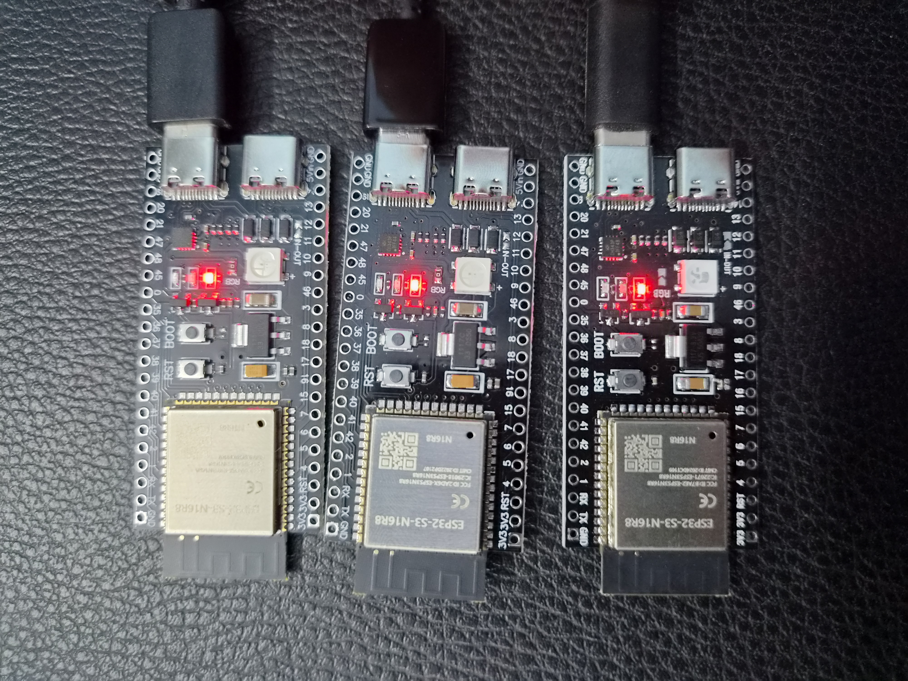
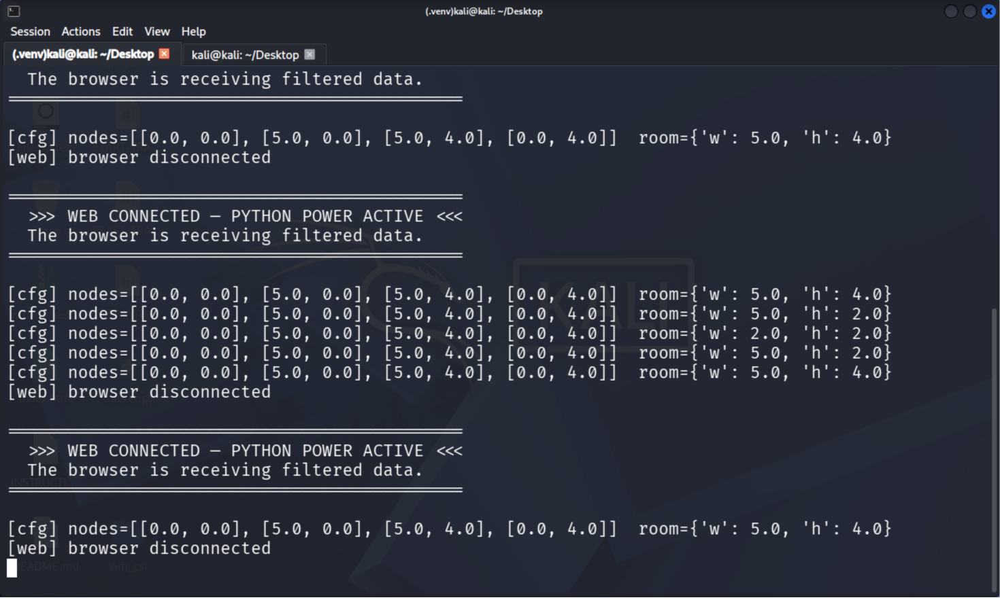
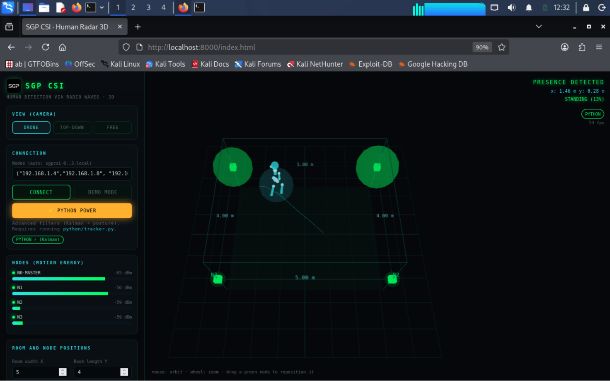
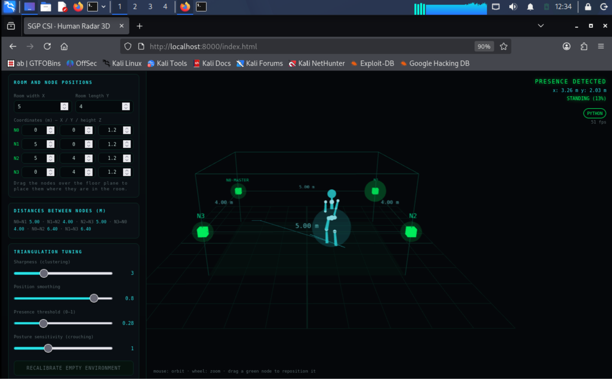

# WiFi CSI Human Radar using ESP32-S3

Real-time human presence detection and indoor tracking using WiFi Channel State Information (CSI), ESP32-S3 microcontrollers, and a Python-powered visualization backend.

---

## Project Overview

Traditional human tracking systems often rely on cameras, wearable devices, or dedicated sensors. This project explores an alternative approach using WiFi Channel State Information (CSI), where changes in wireless signal propagation are analyzed to detect human movement and estimate position.

The system uses multiple ESP32-S3 nodes to collect CSI measurements, streams data over WebSockets, processes signal variations in Python, and visualizes activity through a real-time dashboard.

----
## Documentation Structure

The project is organized with a dedicated documentation folder for clarity and ease of use:

```
docs/
├── architecture.md          -> System design and data flow
├── hardware-setup.md        -> ESP32-S3 setup and physical configuration
├── reproduction-guide.md    -> Step-by-step setup and execution guide
├── troubleshooting.md       -> Common issues and solutions
└── Forensic Technical Code Audit Report.md
```

---

## Key Features

- Real-time WiFi CSI acquisition
    
- Human presence detection
    
- Multi-node ESP32-S3 sensing architecture
    
- Position estimation and movement tracking
    
- Activity and posture estimation
    
- WebSocket-based communication
    
- Python signal processing backend
    
- Interactive visualization dashboard
    

---

## Demonstration

### Hardware Setup



### Python Backend



### Dashboard Visualization



### Real-Time Tracking



---

## System Architecture

```text
ESP32-S3 Nodes
      │
      ▼
WiFi CSI Collection
      │
      ▼
Python Tracker Backend
      │
      ▼
WebSocket Server
      │
      ▼
Visualization Dashboard
```

----
## Technology Stack

### Embedded Systems

- ESP32-S3
    
- Arduino Framework
    
- ESP32 CSI APIs
    
- WebSockets
    
- Adafruit NeoPixel
    

### Backend

- Python
    
- NumPy
    
- Scikit-Learn
    
- Async WebSockets
    

### Frontend

- HTML
    
- JavaScript
    
- Three.js
    

---

## Results

The system successfully demonstrated:

- Real-time CSI acquisition
    
- Human presence detection
    
- Motion tracking
    
- Position estimation
    
- Multi-node wireless sensing
    
- Real-time dashboard visualization
    

---

## Skills Demonstrated

- Embedded Systems Development
    
- ESP32-S3 Programming
    
- Wireless Sensing
    
- WiFi CSI Analysis
    
- Signal Processing
    
- Real-Time Networking
    
- WebSocket Communication
    
- Python Development
    
- Human Activity Recognition
    
- Data Visualization
    

---

## Future Improvements

- Add fourth ESP32-S3 node
    
- Multi-person tracking
    
- Machine learning activity classification
    
- CSI dataset collection pipeline
    
- Improved localization accuracy
    
- Edge AI deployment
    

---

📩 Connect

LinkedIn: https://linkedin.com/in/akshit023/

---

<div align="center">

⭐ If you find this repository useful, consider giving it a star!

</div>

